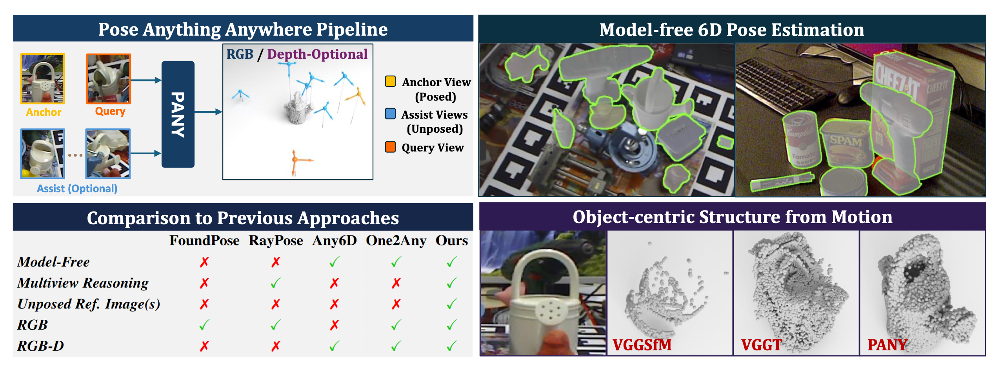
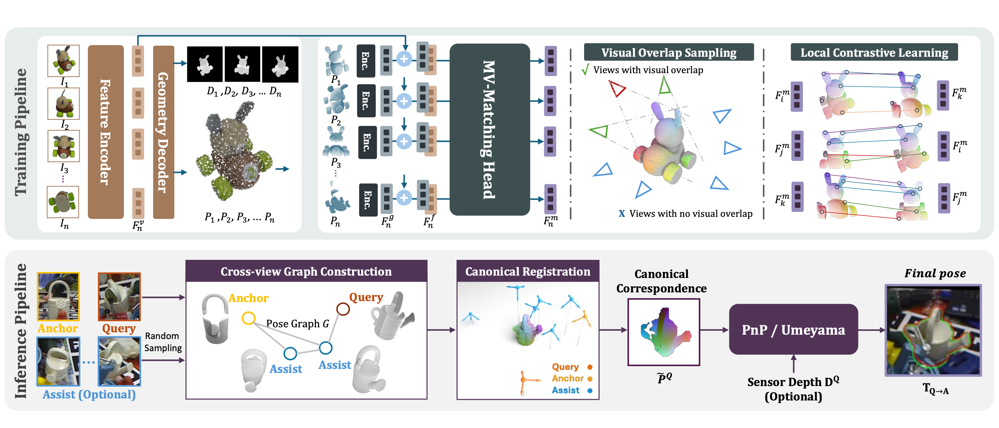

<h1 align="center">Pose Anything Anywhere: Model-free Object Poses from Arbitrary References</h1>

<p align="center">
  <a href="https://arxiv.org/abs/2606.23634"></a>
</p>

<p align="center">
  <strong>Accepted to ECCV 2026</strong>
</p>

<p align="center">
  Hongli Xu<sup>*1</sup>, Jiaqi Hu<sup>*1,3</sup>, Junwen Huang<sup>*&dagger;1,2</sup>, Boyang Zhong<sup>1</sup>, Peter KT Yu<sup>4,5</sup>, Nassir Navab<sup>1,2</sup>, Benjamin Busam<sup>1,2</sup>, Slobodan Ilic<sup>1,3</sup>
</p>

<p align="center">
  <sup>1</sup>Technical University of Munich, <sup>2</sup>Munich Center for Machine Learning (MCML), <sup>3</sup>Siemens AG, <sup>4</sup>XYZ Robotics, <sup>5</sup>ROBOX
</p>

<p align="center">
  <sup>*</sup> Equal contribution. The first three authors are listed in random order. <sup>&dagger;</sup> Corresponding author.
</p>

PANY is a unified model-free 6D object pose estimation framework for arbitrary object references. It supports both RGB and RGB-D inputs, works with one or sparse pose-free reference views, and can use additional unposed assistant views through pose-graph canonical registration for stronger geometric coverage.

<p align="center">
  
</p>

## 💡  PANY Pipeline

<p align="center">
  
</p>

## ⚙️ Environment Setup

Please follow the steps below to install the **Conda** environment for **PANY**.

The experiments in the paper were run with PyTorch 2.3.1 (CUDA 11.8), which we provide as a reference configuration.

```bash
conda env create -f environment.yaml
conda activate PANY

# install Pointnet2
cd vggt/mv_match/model/pointnet2
python -m pip install . --no-build-isolation
cd ../../../..
```

## 💾 PANY Weight

Please download the PANY checkpoint [here](https://drive.google.com/file/d/1vQaAbiNqFyQL7res8kz0C8Ue7ksRJa5Y/view?usp=sharing).

## 📦 Dataset Preparation

### REAL275 (referred as NOCS)

From the [NOCS repository](https://github.com/hughw19/NOCS_CVPR2019), download the test ground truth, object models, and `real_test` partition. This should result in three files: `obj_models.zip`, `gts.zip`, and `real_test.zip`.

Run the `scripts/data_prepare/prepare_nocs.sh` script to unzip and run the preprocessing.

By default, this creates the `nocs` folder in `data/`. You can change the destination by modifying the script.

### Toyota-Light

Download the object models and the test partition from the official BOP website:

```bash
wget https://bop.felk.cvut.cz/media/data/bop_datasets/tyol_models.zip
wget https://bop.felk.cvut.cz/media/data/bop_datasets/tyol_test_bop19.zip
```

Run the `scripts/data_prepare/prepare_toyl.sh` script to unzip and run the preprocessing.

By default, this creates the `toyl` folder in `data/`. You can change the destination by modifying the script.

### Linemod-Occluded / Linemod / YCB-Video

Download these three datasets from [BOP Benchmark](https://bop.felk.cvut.cz/datasets/).

```bash
pip install -U "huggingface_hub[cli]"

export DATASET_NAME=lm
huggingface-cli download bop-benchmark/$DATASET_NAME --local-dir ./${DATASET_NAME}/ --repo-type=dataset

export DATASET_NAME=lmo
huggingface-cli download bop-benchmark/$DATASET_NAME --local-dir ./${DATASET_NAME}/ --repo-type=dataset

export DATASET_NAME=ycbv
huggingface-cli download bop-benchmark/$DATASET_NAME --local-dir ./${DATASET_NAME}/ --repo-type=dataset
```

## 🚀 Inference

### Single-view Inference

Before running the scripts, please check `scripts/configs/` and make sure the data paths in the configs are correct.

```bash
# Inference on lm (Linemod)
python scripts/single-view/RGB-D_single_reference_lm.py

# Inference on ycbv (YCB-Video)
python scripts/single-view/RGB-D_single_reference_ycbv.py

# Inference on lmo (Linemod-Occluded)
python scripts/single-view/RGB_single_reference_lmo.py

# Inference on real275 (nocs)
python scripts/single-view/RGB-D_single_reference_real275.py

# Inference on toyota-light
python scripts/single-view/RGB-D_single_reference_toyota.py
```

### Multi-view Inference

For multi-view inference with one anchor view and unposed assistant views, first download the multi-view references from [multi-view-references](https://drive.google.com/file/d/1aTFMJPpexXIzVB1621ZQlI0GP1P3HEka/view?usp=sharing) and place them under `data/`.

Before running the scripts, please also check `scripts/configs/` and make sure the data paths in the configs are correct.

```bash
# Inference on lm (Linemod)
python scripts/multi-view/inference_lm_mv_sfm.py  # Build pose graph
python scripts/multi-view/inference_lm_mv_unposed.py

# Inference on ycbv (YCB-Video)
python scripts/multi-view/inference_ycbv_mv_sfm.py  # Build pose graph
python scripts/multi-view/inference_ycbv_mv_unposed.py

# Inference on lmo (Linemod-Occluded) with CNOS mask
python scripts/multi-view/inference_lmo_mv_sfm.py  # Build pose graph
python scripts/multi-view/inference_lmo_mv_unposed.py
```

## Citation

If you find this work useful in your research, please cite:

```bibtex
@inproceedings{xu2026pose,
  title={Pose Anything Anywhere: Model-free Object Poses from Arbitrary References},
  author={Xu, Hongli and Hu, Jiaqi and Huang, Junwen and Zhong, Boyang and Yu, Peter KT and Navab, Nassir and Busam, Benjamin and Ilic, Slobodan},
  booktitle={European Conference on Computer Vision (ECCV)},
  year={2026}
}
```

## Acknowledgements

We thank the authors of the following repositories for open-sourcing the code, on which we relied for this project:

- [VGGT](https://github.com/facebookresearch/vggt)
- [Oryon](https://github.com/jcorsetti/oryon)
- [Omni6DPose](https://github.com/Omni6DPose/Omni6DPoseAPI)
- [SAM-6D](https://github.com/JiehongLin/SAM-6D)
- [BOP Toolkit](https://github.com/thodan/bop_toolkit)
